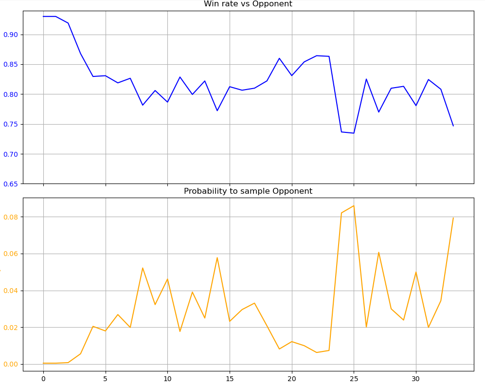

#TODO

- Policy & Value network shared backbone

Opponent Sampling:
During experience generation, opponents are sampled with probabilities inversely proportional to the current policy's performance against them. In other words, opponents against whom the policy has a lower win rate are chosen more frequently, allowing the policy to focus on its weaknesses.

The left plot shows the current win rate for each opponent (indexed by i), while the right plot displays the sampling weight assigned to each opponent.
